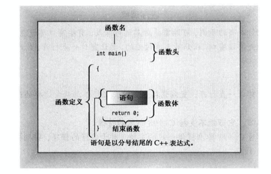

## 第二章 开始学习C++

### 👉【[复习题](./复习题.md)】【[编程练习题](./Codes)】

## 1. 进入C++
```cpp
/*第一个C++程序*/

#include <iostream>
using namespace std; /*定义一个可视化*/

int main(void)
{
    cout<<"Come up an C++"<<endl;
    cout<<"You won't regret it"<<endl;

    return 0;
}
```

对于一个C++ 程序主要包含以下元素：
- 注释：由前缀`//` 或者是 `/* */` 标识
- 预处理器编译指令`#include`
- 函数头：`int main() `
- 编译指令：`using namespace`
- 函数体：用`{ } `括起来
- 使用C++ 的`cout`工具显示消息的语句
- 结束`main()`函数的`return`语句

### 1.1、`main()`函数头
main() 被启动代码调用，而启动代码是编译器添加到程序中。
>函数头描述 `main()` 和OS（UNIX/Linux、Windows、mac os等）直接的`接口`。

`空括号的main()` 不接受任何参数。

```cpp
int main(void)
{
    statement
    return 0;
}
```
`main()`函数描述了函数的行为。同时也构成了两部分的 **`函数定义（function definition）`** ：第一行`int main()`函数叫做 **`函数头（function heading）`**，花括号({和})中包括的部分叫 **`函数体`**。

函数体：指出函数应做什么的计算机指令。

在C++中，每条完整的指令叫做`语句`。所有的语句都是以 `分号`结束。



`main()`中最后一条语句叫做 ` 返回语句（return statement）`，结束main()函数。 

⚠️注意：C++程序通常是以`main() `函数开始执行，如果没有，程序不完整，则`编译器会指出未定义main()函数`。
> 大小写都必须准确
>
> 不需要`main()函数`的特殊情况：
> 1. Windows中的`动态链接（DLL）`模块。
> 2. 单片机或机器人芯片

### 1.2、C++注释
C++中的注释以 **`双斜杠（//）`** 打头。以`行尾`作为结束。

**注释的作用**：为程序提供解释说明，使得程序通俗易懂。

通常标识程序的一部分或者是标识代码的某个方面。

**注意点**：编译器不会运行，会直接忽略注释。

C++也可以识别C语言的注释

C语言风格的注释
- **`多行注释`**：符号`/* `和 `*/` 之间，以 `*/` 作为注释的结束。
- **`单行注释`**：以 **`双斜杠（//）`** 开始，`行尾`作为结束。

### 1.3、预处理器和头文件
如果程序要使用C++输入或输出工具时，必须使用两行代码：
```cpp
#include <iostream>
using namespace std;
```

使用了 `#include`作为了预编译指令，也就是所谓的预处理器指令。
> 预处理器的操作：在源代码被编译之前，替换或添加文本。

例如：
```cpp
#include <iostream>
```
像iostream这样的文件叫做 **`包含文件（include file）`** ———— 也被包含在其他的文件中，所以也叫做 **`头文件（header file）` **。

头文件命名约定
|头文件类型|约定|示例|说明|
|:--:|:--:|:--:|:--:|
|C++旧式风格|以 `.h` 结尾|iostream.h|C++程序可以使用|
|C旧式风格|以 `.h` 结尾|math.h|C、C++ 程序可以使用|
|C++ 新式风格|没有扩展名|iostream|C++程序可以使用，使用namespace std;|
|转换后的C|加上前缀c，没有扩展名|cmath|C++ 程序可以使用，可以使用不是C的特性，如namespace std;|


### 1.4、名称空间（namespace）
如果程序中使用的是 `iostream` ，那么就需要使用名称空间编译指令来使得对程序可用。
```cpp
using namespace std;
```
也叫做 **using编译指令**。

### 1.5、使用cout进行C++的输出
```cpp
    cout<<"Come up an C++"<<endl;
    cout<<"You won't regret it"<<endl;
```

双引号 括起来的部分就是要打印的消息。

在C++中，使用`双引号`括起来的一系列字符叫做 **字符串**，由于若干个字符组合而成。

`<<` 指出信息流动的路径，cout是一个`预定义的对象`。


#### 控制符`endl`
```cpp
cout<<endl;
```
endl 是C++中的一个特殊符号，作用：**重起一行**。

在输出流中插入`endl`使得屏幕光标移到下一行开头。

endl在头文件`iostream`中定义，且位于`名称空间std`中。

#### 换行符
C++也也提供了早期C语言表示换行的方法；C语言符号`\n`。

`\n` 被视为一个字符，名为`换行符`，也就是C++中的`endl的重起一行`。

显示字符串时，在字符串中包含换行符，而不是在末尾添加endl，可减少输入量。

```cpp
/*两个语法都是一样的，都是：重起一行*/
cout<<"\n";
cout<<endl;
```

### 1.6、C++源代码风格

C++中源代码的风格遵循以下规则：

- 每条语句各占一行。
- 每个函数都有一个`开始花括号`和一个`结束花括号`，两个花括号各占一行。
- 函数中的语句都相对于花括号进行缩进。
- 与函数名称相关的`圆括号周围没有空白`。

## 2. C++语句

程序代码例子：
```cpp
#include<iostream>
using namespace std;

int main()
{
    int carrots; // 声明一个整型变量

    carrots = 25; // 给变量赋值
    cout<<"我有 "<<carrots<<" 个carrots."<<endl;

    carrots = carrots - 1; // 对变量进行修改
    cout<<"快看！快看！现在，我有 "<<carrots<<" 个carrots!"<<endl;

    return 0;   
}
```

### 2.1 声明语句和变量


